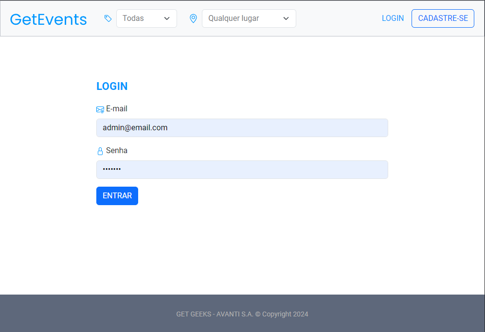

# Plataforma de Gerenciamento de Eventos Culturais (Front-end)

## ℹ️ Sobre

GetEvents é uma plataforma completa para o gerenciamento de eventos culturais, projetada para simplificar a organização, visualização e o cadastramento de eventos. Com uma interface intuitiva, fácil de usar e responsiva, a plataforma oferece acesso personalizado para organizadores, visitantes e administradores.

Na página inicial, os usuários podem visualizar todos os eventos cadastrados através de cards que mostram detalhes como localização e horário. A plataforma possui um front-end robusto e um back-end seguro desenvolvido por nossa equipe, garantindo desempenho e segurança.

Administradores, via login, podem gerenciar locais, cargos e categorias de eventos, além de criar, editar e excluir eventos. Organizadores, após se cadastrarem, podem criar, editar e excluir eventos e locais. Visitantes têm acesso à visualização e detalhes dos eventos. A plataforma também permite filtrar eventos por nome do evento, categoria e local.

GetEvents atende às necessidades dos organizadores de eventos culturais, facilitando a gestão de todas as etapas, desde a criação até a promoção dos eventos.

🗓️ O **período de desenvolvimento** deste projeto foi de `11/05/2024` a `22/05/2024` e foi utilizado como parte avaliativa para a conclusão do Avanti Bootcamp.


## 💻 Tecnologias e ferramentas utilizadas
As seguintes tecnologias e ferramentas foram utilizadas no desenvolvimento da plataforma GetEvents:

- Front-end:
  - HTML5
  - CSS3
  - JavaScript
  - React.js


- Back-end:
  - Node.js
  - Express.js
  - Prisma


- Banco de Dados:
  - PostgreSQL


- Autenticação e Autorização:
  - JWT (JSON Web Tokens)
  - bcrypt.js (para hash de senhas)


- Versionamento de Código:
  - Git
  - GitHub


- Outras Ferramentas:
  - Insomnia (para testes de API)
  - VS Code (editor de código)
  - Intellij (editor de código)


## Pré-requisitos para executar a aplicação

Antes de utilizar o projeto, certifique-se de seguir as seguintes etapas:

- [x] **Ter o Git instalado na máquina.**
- [x] **Ter o Node.js instalado.**
- [x] **Ter um editor de código de sua preferência.**
- [x] **Ter clonado e executado o repositório do back-end, disponível [aqui](https://github.com/Avanti-Bootcamp-GET-Geeks/back-end-plataforma-eventos-culturais).**
- [x] **Clonar este repositório com o comando abaixo:**

  ```shell
  git clone https://github.com/Avanti-Bootcamp-GET-Geeks/GetEvents.git
  ```

## ⚙️ Configurações necessárias

Com o repositório clonado, execute os seguintes comandos no diretório do projeto:

- **Para baixar as dependências**:

  ```shell
  npm install
  ```

>[!IMPORTANT]
>
> Antes de iniciar este projeto, todas as configurações da aplicação do back-end devem estar concluídas.

- **Para iniciar a aplicação**:

  ```shell
  npm run dev
  ```

## ✅ Resultados obtidos


